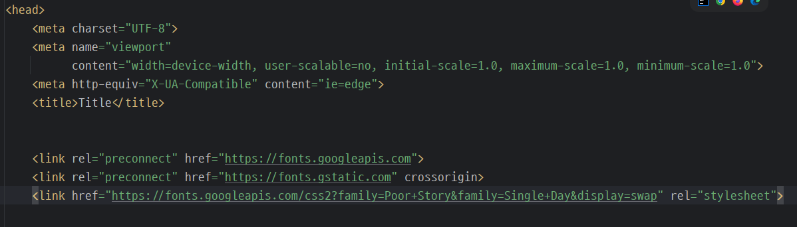

# 뷰포트 단위(vw,vh)

### 사용자가 보고있는 브라우저 창의 화면 영역
### ex) 1920x1080 환경에서 vw 1 = 19.2px vh = 10.8px 이 된다.
###  디스플레이 환경에 맞춰 값이 달라지므로 반응형 웹 디자인에 많이 사용된다.
### 웹사이트를 늘렸다 줄였다 하면 맞춰서 늘었다 줄었다 한다.

<div style="margin-top:15vh;"></div>


## 텍스트 단위 정리

<div style="margin-top:10vh;"></div>

### 1. px(픽셀)은 절대 단위
### 2. em, 퍼센트는 부모기준에 맞춰 변하는 상대 단위
### 3. rem은 HTML 설정에 따라가는 상대 단위
### 4. vw,vh는 사용자의 디스플레이 환경에 따라가는 상대 단위

<div style="margin-top:20vh;"></div>

# 텍스트와 폰트 스타일링

<div style="margin-top:10vh;"></div>


| 속성명               | 설명       | 예시 값                                            | 비고                       |
| ----------------- | -------- | ----------------------------------------------- | ------------------------ |
| `color`           | 글자 색상    | `#333333`, `red`, `rgba(0,0,0,0.8)`             | 텍스트 색상 설정                |
| `font-size`       | 글자 크기    | `18px`, `1.5rem`, `2vw`                         | `rem`, `em`, `%` 등도 가능   |
| `font-family`     | 글꼴 지정    | `'Arial', sans-serif`                           | 여러 개 지정 가능 (앞에서부터 시도)    |
| `font-weight`     | 글자 두께    | `normal`, `bold`, `100~900`                     | `400` = 기본, `700` = bold |
| `font-style`      | 기울임      | `normal`, `italic`, `oblique`                   |                          |
| `text-align`      | 정렬 방식    | `left`, `center`, `right`, `justify`            | 블록 요소 내 정렬               |
| `text-decoration` | 줄 긋기     | `none`, `underline`, `line-through`, `overline` |                          |
| `text-transform`  | 대소문자 변환  | `none`, `uppercase`, `lowercase`, `capitalize`  |                          |
| `line-height`     | 줄 간격     | `1.5`, `24px` 등                                 | 글자가 겹치지 않게 하기 위해 중요      |
| `letter-spacing`  | 글자 사이 간격 | `0.1em`, `2px` 등                                | 자간 조절                    |
| `word-spacing`    | 단어 사이 간격 | `5px`, `1em` 등                                  | 띄어쓰기 간격 조절               |
| `white-space`     | 공백 처리 방식 | `normal`, `nowrap`, `pre`, `pre-wrap` 등         | 줄바꿈/공백 유지 등 제어           |
| `direction`       | 텍스트 방향   | `ltr`, `rtl`                                    | 아랍어 등 오른쪽→왼쪽 지원          |
| `text-shadow`     | 텍스트 그림자  | `2px 2px 5px gray`                              | 간단한 입체감 표현 가능            |


<div style="margin-top:10vh;"></div>


### font 관련 속성들끼리 이렇게 한 줄로 묶을 수도 있다.

```
font: italic bold 18px 'Arial', sans-serif;
```

### font-family로 글꼴 지정을 할때 마지막에 , sans-serif는 주 글꼴이 없는 환경일때 
### 기본 글꼴로 대체하기 위해서 꼭 적는다. 폰트 이름이 아닌 셰리프 혹은 산 셰리프 처럼 기준 형을 적는다.

<div style="margin-top:15vh;"></div>

### 원하는 글꼴을 추가하고 싶으면 이렇게 Head 태그에 링크를 걸어주어야 한다.




<div style="margin-top:20vh;"></div>


# BOX 모델

<div style="margin-top:10vh;"></div>

## 박스 모델의 구성 요소 

<div style="margin-top:5vh;"></div>

### 박스 모델은 네 가지 주요 구성 요소로 이루어져 있습니다:

<div style="margin-top:10vh;"></div>

### 1. **콘텐츠(Content)**: 요소의 실제 콘텐츠가 들어가는 영역입니다. 텍스트, 이미지 등 요소의 내용을 포함합니다.
### 2. **패딩(Padding)**: 콘텐츠와 보더 사이의 내부 여백입니다. 패딩은 콘텐츠 영역을 감싸는 여백으로, 배경색이 패딩 영역까지 확장됩니다.
### 3. **보더(Border)**: 콘텐츠와 패딩을 둘러싸는 테두리입니다. 보더의 두께, 스타일, 색상을 설정할 수 있습니다.
### 4. **마진(Margin)**: 요소의 바깥 여백으로, 보더와 인접한 다른 요소 사이의 공간을 제공합니다. 마진은 배경색의 영향을 받지 않습니다.


<div style="margin-top:10vh;"></div>

### 🍱 도시락통에 비유한 박스 모델

```

+-------------------------+     ← 마진 (다른 도시락과의 거리)
|        Margin           |
| +---------------------+ |     ← 보더 (도시락통 뚜껑과 벽)
| |      Border         | |
| | +-----------------+ | |     ← 패딩 (도시락통 내부 여백)
| | |    Padding      | | |
| | | +-------------+ | | |     ← 콘텐츠 (밥, 반찬 = 진짜 내용)
| | | |  Content    | | | |
| | | +-------------+ | | |
| | +-----------------+ | |
| +---------------------+ |
+-------------------------+

```
<div style="margin-top:15vh;"></div>

# 패딩과 보더는 박스의 크기에 영향을 끼친다.

<div style="margin-top:10vh;"></div>

```
.box {
  width: 200px;
  padding: 20px;
  border: 2px solid black;
  margin: 10px;
}
```

### 이 상황은 기본 박스의 너비 200px에 보더 좌우 합 4px, 패딩 좌우 합 40px 이 추가되어
### 실제 보이는 박스 사이즈는 244px가 된다. 이런경우를 방지하기 위해

### `box-sizing: border-box` 속성을 사용하면 설정해둔 박스사이즈를 유지해준다.

### 그래서 보통 `*{}` 전체 선택자에  `box-sizing: border-box` 와 `margin: 0;` 을 기본적으로 입력하고 한다. 

### body 태그의 디폴트 margin 값은 8px 이므로 따로 지정해 주지 않으면 8px 띄어진 상태로 시작하기 때문.

<div style="margin-top:15vh;"></div>

# margin 단축속성

<div style="margin-top:10vh;"></div>

```
/*  마진 단축 속성  */

            /* 4방향 전부 균일한 마진을 넣음 */
            margin: 7px;

            /*      [상하] [좌우] */
            margin: 10px 20px;

            /*     [상]  [좌우] [하]*/
            margin: 10px 20px 30px;

            /* 12시부터 시계방향  */
            margin: 10px 20px 30px 40px;
```


### margin: 0 auto 로 x축 가운데 정렬을 할 수 있다.
### auto는  "자동으로 계산해서 빈 공간을 균등하게 채워줘"라는 의미
### margin: auto는 남는 공간을 계산해서 양쪽에 배분하기 때문에
### 요소의 width를 정의해주지 않으면 남는 공간 계산이 안되서 효과가 없음


<div style="margin-top:15vh;"></div>

# 2. Border

<div style="margin-top:10vh;"></div>

### 보더의 개별 속성들

### -`border-width`: 보더의 두께를 지정합니다.
### - `border-style`: 보더의 스타일을 지정합니다. (예: `solid`, `dashed`, `dotted`, `none`)
### - `border-color`: 보더의 색상을 지정합니다.

<div style="margin-top:10vh;"></div>

## **보더 단축 속성**
### - 일반적으로 `border: width style color;` 순서로 지정한다.
### 순서는 바뀌어도 상관이 없긴하다.


<div style="margin-top:15vh;"></div>


### border 명령어 정리

| 속성                                            | 설명                            | 예시                             |
| --------------------------------------------- | ----------------------------- | ------------------------------ |
| `border`                                      | 테두리 전체를 한 번에 설정 (두께, 스타일, 색상) | `border: 1px solid #333;`      |
| `border-width`                                | 테두리의 두께만 지정                   | `border-width: 2px;`           |
| `border-style`                                | 테두리 스타일 지정                    | `border-style: solid;`         |
| `border-color`                                | 테두리 색상 지정                     | `border-color: red;`           |
| `border-top` / `-right` / `-bottom` / `-left` | 특정 방향 테두리만 지정                 | `border-top: 2px dashed blue;` |
| `border-radius`                               | 테두리 모서리를 둥글게 만듦               | `border-radius: 10px;`         |

<div style="margin-top:20vh;"></div>


# Padding


<div style="margin-top:5vh;"></div>

### 패딩(Padding)은 콘텐츠와 보더 사이의 내부 여백을 정의합니다. <br>패딩은 각 면에 대해 개별적으로 지정할 수 있으며, 단축 속성을 사용해 여러 값을 한 번에 설정할 수 있습니다.

<div style="margin-top:15vh;"></div>

# 패딩 단축속성

<div style="margin-top:5vh;"></div>

### - 네 개의 값을 지정할 때: `padding: top right bottom left;`
### - 세 개의 값을 지정할 때: `padding: top right/left bottom;`
### - 두 개의 값을 지정할 때: `padding: top/bottom right/left;`
### - 하나의 값을 지정할 때: 모든 면에 동일한 값이 적용됩니다.


<div style="margin-top:15vh;"></div>

# 디스플레이 속성

<div style="margin-top:10vh;"></div>

| 구분              | 블록 요소 (`block`)                              | 인라인 요소 (`inline`)                          | 인라인 블록 요소 (`inline-block`)           |
| --------------- | -------------------------------------------- | ------------------------------------------ | ------------------------------------ |
| **대표 태그**       | `div`, `p`, `h1~h6`, `ul`, `ol`, `section` 등 | `a`, `span`, `strong`, `em`, `b`, `abbr` 등 | `input`, `img`, `button`, `select` 등 |
| **디폴트 배치 방향**   | 세로로 쌓임 (줄 바꿈 발생)                             | 가로로 나열됨 (줄 바꿈 없음)                          | 가로로 나열됨 (줄 바꿈 없음)                    |
| **가로/세로 크기 지정** | 가능 ✅                                         | 불가능 ❌                                      | 가능 ✅                                 |
| **전체 영역 차지**    | 부모 너비 전체 차지 (가로 100%)                        | 내용만큼만 차지                                   | 내용만큼 차지하지만 크기 조절 가능                  |
| **박스 모델 적용 여부** | 완전히 적용됨                                      | 부분 적용됨 (크기 조절 불가)                          | 완전히 적용됨                              |
| **레이아웃 구성**     | 주로 레이아웃 단위 요소                                | 주로 텍스트 스타일링용                               | 버튼, 썸네일 등에 사용                        |


<div style="margin-top:10vh;"></div>

### 각각 `display: block;` `display: inline;` `display: inline-block;` 로 디폴트가 되어있고 설정을 바꿀수도 있다.
                    
### Tip ) a태그(하이퍼링크)를 블록형식으로 바꾸면 터치영역도 그 블록영역으로 늘어남


<div style="margin-top:15vh;"></div>


# display: none;

### `display: none;` 을 하면 요소를 완전히 숨긴다. <br> 이렇게 되면 해당 요소는 문서의 레이아웃에 아무런 영향도 끼치지 않고 공간을 차지하지도 않는다.

### `opacity: n;` 은 투명도를 조절한다. `opacity: 0;` 을 하면 요소가 보이지 않지만 # display: none; 과는 다르게 자리도 차지하고 레이아웃에 영향을 끼친다.

<div style="margin-top:15vh;"></div>

# Overflow


### 박스 안의 내용이 박스보다 클 경우 넘치는 부분을 제어하는 것

<div style="margin-top:15vh;"></div>

| 값                | 의미                                              |
|-------------------|---------------------------------------------------|
| visible (기본값)  | 전체를 다 보여줌                                  |
| hidden            | 넘치는 콘텐츠를 숨김                              |
| auto              | 넘치는 콘텐츠가 존재할 경우에만 스크롤바를 생성   |
| scroll            | 넘치는 콘텐츠가 없어도 스크롤바를 생성           |

<div style="margin-top:20vh;"></div>


# 기타 알게 된 것들


### 컨트롤 + 스페이스 자동완성 추천 단축키

### height의 디폴트는 컨텐츠의 크기이다.

### height에 퍼센트 값을 쓰려면 부모나 조상의 height값이 명시되어 있어야 한다.
### 콘텐츠에 따라 자동으로 계산된 auto 값은 반영이 되지 않는다.
### 암튼 퍼센트를 쓰려면 부모의 height값이 퍼센트든 뭐로든 명시가 되어야함