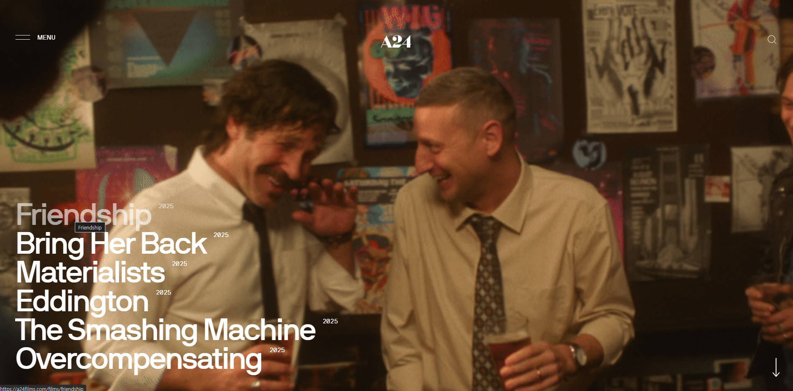
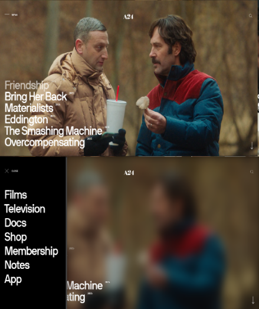
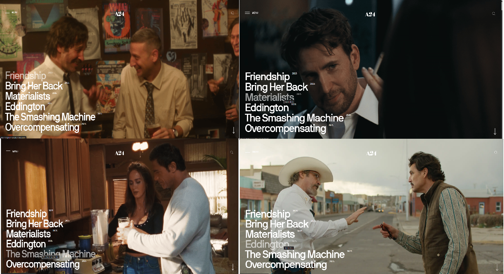
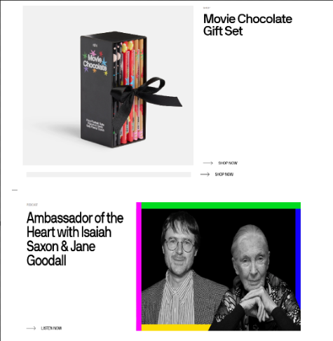
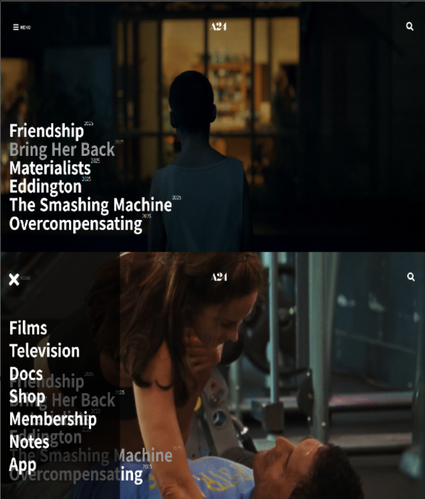

# https://a24films.com/


### 내가 좋아하는 영화 제작사 홈페이지이다.
### 영화 제작사라 역시 이미지 위주의 간결한 디자인이다.
### 내가 갖고있는 지식으로 따라 만들어 보는 것이 가장 큰 공부가 될 것이라 생각하여 따라 만들어 보았다.


<div style="margin-top:15vh;"></div>


# 레퍼런스 사이트 특징

<div style="margin-top:15vh;"></div>

# 1. 팝업 메뉴



### 좌측 상단의 메뉴를 누르면 이런식으로 팝업이 된다. 
### 아직 js를 배우지 않았지만 놀랍게도 이 팝업 메뉴 코드는 오늘 선생님이 알려주었다. 그걸 사용하면 구현 가능할 것 같다.
### 스크린 샷에는 배경사진이 블러가 되었지만 메뉴를 눌러서 바뀐 것이 아니다.
### 시간이 지나면 저 영화목록들에 해당하는 영화의 스틸 이미지들이 자동으로 다음 영화로 넘어가진다.

<div style="margin-top:15vh;"></div>


# 2. 영화 리스트




### 이 사이트의 가장 인상적인 부분이다. 
### 제작사의 개봉 예정 혹은 최신 영화들의 목록이 고정되어 리스트되어있고 영화 제목에 커서를 올리면
### 해당 영화의 장면들이 gif로 재생이 된다.

<div style="margin-top:15vh;"></div>

# 3. 굿즈 샵 페이지 와 인터뷰




### 저 영화 리스트에서 스크롤 다운을 하면 이런식으로 제작사의 굿즈나 진행한 인터뷰 등의 내용들이 나온다.

### 저렇게 왼쪽에 이미지, 우측에 내용으로 된 링크 혹은 그 반대의 레이아웃 식의 반복이다.

### ✨ 레이아웃을 만들어 놓고 나중에 복붙해서 새로운 내용들을 쉽게 추가하기 용이하게 구조를 짜야겠다고 생각했다.


<div style="margin-top:15vh;"></div>


# 작업 1일차.


### 우선 헤더와 영화 리스트 부분 까지만 작업해보기로 했다.

<div style="margin-top:15vh;"></div>


# 🏢 html

``` html

<body>
    <header>
        <!-------------- 헤더 ---------------->
        <a href="#" onclick="event.preventDefault();" class="menu-open">
            <span class="bar-icon">
            <i class="fas fa-bars"></i>
          </span>
            <span class="menu-txt">MENU</span>
        </a>
        <h1 class="logo"><a href="#"></a></h1>

        <a href="#" class="search-open">
            <i class="fas fa-search"></i>
        </a>

        <!----- 사이드 메뉴 ----->
        <nav class="gnb">
            <a href="#" onclick="event.preventDefault();" class="close">
                <i class="fas fa-times"></i>
            </a>
            <ul>
                <li><a href="#">Films</a></li>
                <li><a href="#">Television</a></li>
                <li><a href="#">Docs</a></li>
                <li><a href="#">Shop</a></li>
                <li><a href="#">Membership</a></li>
                <li><a href="#">Notes</a></li>
                <li><a href="#">App</a></li>
            </ul>
        </nav>

    </header>
    <main class="main-content">
        <!--  최신 영화 리스트  -->
        <section class="movie-list">
            <ul class="movie">
                <li><a href="#" data-bg="https://d135u4jtzauizi.cloudfront.net/friendshipgif1.gif">Friendship<span
                        class="since">2025</span></a></li>
                <li><a href="#"
                       data-bg="https://d135u4jtzauizi.cloudfront.net/2ad833b4-3dd3-1495-58d7-df55ba94563e.gif">Bring
                    Her Back<span class="since">2025</span></a></li>
                <li><a href="#" data-bg="https://d135u4jtzauizi.cloudfront.net/cigarette-1.gif">Materialists<span
                        class="since">2025</span></a></li>
                <li><a href="#" data-bg="https://d135u4jtzauizi.cloudfront.net/_hero/121189/EDDINGTON-FIRST-LOOK.webp">Eddington<span
                        class="since">2025</span></a></li>
                <li><a href="#" data-bg="https://d135u4jtzauizi.cloudfront.net/TSM-1.gif">The Smashing Machine<span
                        class="since">2025</span></a><span class="since">2025</span></li>
                <li><a href="#"
                       data-bg="https://d135u4jtzauizi.cloudfront.net/_hero/121944/Screenshot-2025-04-29-at-10.40.38-AM_2025-04-29-155400_xivs.webp">Overcompensating<span
                        class="since">2025</span></a>>
                </li>
            </ul>
        </section>
    </main>
```


# css

``` css
@import url(../common.css);


body {
    font-size: 16px;
    background: #333;
    height: 400em;
}

header {
    display: flex;
    width: 100%;
    justify-content: space-between;
    padding-top: 4%;
    position: fixed;
}


header .logo img {
    width: 4.5em;
    filter: grayscale(100%) invert(100%);
}

header .menu-open {
    display: flex;
    align-items: flex-end;
    justify-content: center;
    margin-left: 3%;
    color: white;
}

header .menu-open .menu-txt {
    margin-left: 0.5em;
    margin-bottom: 0.3em;
}

header .menu-open .bar-icon {
    font-size: 1.7em;
}

header .search-open {
    font-size: 2em;
    display: flex;
    align-items: center;
    justify-content: center;
    margin-right: 3%;
    color: white;
}


header .gnb {
    height: 100vh;
    position: fixed;
    top: 0;
    width: 28%;
    font-size: 4em;
    font-weight: 600;
    padding-left: 2%;
    padding-top: 3%;
    line-height: 1.3em;
    color: white;
    background: rgba(0, 0, 0, 70%);
    z-index: 10;
    left: -30%;
    transition: 0.4s ease-out;
}

header .gnb .fa-times {
    margin-bottom: 20%;
    transition: 0.3s ease;
}

header .gnb .fa-times:hover {
    color: #999999;
}

header .gnb li {
    transition: 0.3s ease;
}

header .gnb li:hover {
    color: #999999;
}

header .gnb.on {
    left: 0;
}

main .movie-list {
    width: 100vw;
    height: 100vh;
    display: flex;
    flex-direction: column;
    align-items: flex-start;
    justify-content: center;
    font-size: 4em;
    font-weight: 600;
    color: white;
}

main .movie-list .movie {
    margin-top: 20%;
    margin-left: 2%;

}

main .movie-list .movie li {
    width: 100vw;
    margin-top: 0.2%;
    transition: 0.3s ease;
    display: flex;

}

main .movie-list .movie li:hover {
    color: #999999;
}

main .movie-list .movie li > a {
    display: flex;
    width: 100vw;
}

main .movie-list .movie li .since {
    font-size: 0.3em;
    font-weight: 300;
}
```


# Javascript

```js
<script>
    //버튼의 요소 노드 취득
    const menuBtn = document.querySelector('header .menu-open');
    const closeBtn = document.querySelector('.gnb .close');

    const gnb = document.querySelector('.gnb');

    //클릭 이벤트 생성
    menuBtn.addEventListener('click', () => {
        gnb.classList.add('on');
    });

    closeBtn.addEventListener('click', () => {
        gnb.classList.remove('on');
    });

    document.addEventListener('keyup', (e) => {
        if (e.key === 'escape') {
            gnb.classList.toggle('on');
        }
    })
    const main = document.querySelector('.main-content');
    const links = document.querySelectorAll('.movie-list a');

    links.forEach(link => {
        const bg = link.getAttribute('data-bg');

        link.addEventListener('mouseenter', () => {
            main.style.backgroundImage = `url(${bg})`;
        });

        link.addEventListener('mouseleave', () => {
            main.style.backgroundImage = ''; // 초기화하거나 기본 이미지로 변경
        });
        // 배경 이미지 속성 설정
        main.style.backgroundImage = `url(${bg})`;
        main.style.backgroundRepeat = 'no-repeat';
        main.style.backgroundSize = 'cover';
        main.style.backgroundPosition = 'center';
    });


</script>

```

<div style="margin-top:15vh;"></div>

# 1일차 결과물





### 팝업 메뉴는 레퍼런스와 다르게 투명도를 주었는데, 최초 스크롤의 영화 리스트와 겹쳐보여서 가독성이 좋지않아
### 수정해야겠다고 생각했다. 

<div style="margin-top:15vh;"></div>

# 작업시 있었던 문제점과 해결과정


### 단순하게 `a:hover` 를 사용하여 각자 영화 제목들에 background-image 를 적용 하면 되겠구나 생각했지만
### 내가 적용해야 하는 background-image는 li>a 로 만들어진 제목들이 아닌 조상 요소인 section 태그였다.
### css에서는 이렇게 자식요소에서 위로 역행하는 상호작용을 설정하는 것이 불가능하여 gpt를 이용해서 자바스크립트 코드를 얻었다.

```js
const main = document.querySelector('.main-content');
    const links = document.querySelectorAll('.movie-list a');

    links.forEach(link => {
        const bg = link.getAttribute('data-bg');

        link.addEventListener('mouseenter', () => {
            main.style.backgroundImage = `url(${bg})`;
        });

        link.addEventListener('mouseleave', () => {
            main.style.backgroundImage = ''; // 초기화하거나 기본 이미지로 변경
        });
```

### 바로 이 부분이 영화 제목에 hover 했을때 조상인 .main-content 클래스의 배경화면을 바꿔주는 부분이다.
### 그리고 이렇게 하기 위해서는

```html
                <li><a href="#" data-bg="https://d135u4jtzauizi.cloudfront.net/friendshipgif1.gif">Friendship<span
                        class="since">2025</span></a></li>
```
### 이렇게 li>a 태그들에 data-bg로 링크를 걸어주어야 했다.
### 이러고 나니 원하는대로 마우스 커서에 따라 배경은 바뀌는데 배경들의 사이즈가 cover로 되지도 않고, 작은 사이즈로 repeat 되어 출력되었다.

### css 코드에는 background-image: cover; 가 되어있었지만 먹히지 않는 상황.

```js
// 배경 이미지 속성 설정
        main.style.backgroundImage = `url(${bg})`;
        main.style.backgroundRepeat = 'no-repeat';
        main.style.backgroundSize = 'cover';
        main.style.backgroundPosition = 'center';
    });
```

### 그래서 이렇게 JS에서 직접 속성설정을 하니 해결이 되었다.

<div style="margin-top:15vh;"></div>

# TIL

### CSS에서는 자식요소가 부모의 요소를 컨트롤 할 수는 없다. 역행 불가.
### JS에서는 상황별로 css 코드의 직접적인 변화를 줄 수가 있다.

<div style="margin-top:15vh;"></div>

# 다음 목표

### 우선 다음 스크롤들을 추가하여 만들고 하나씩 기능들을 추가해나가야겠다.

### 다음 스크롤인 굿즈샵, 행사나 소식 같은 부분들의 레이아웃은 좌우 순서만 바뀌었지 레이아웃 자체는 같다.
### 그래서 그 부분을 작업을 할때 추후에 내용을 수정하기에 용이하도록 구조를 만드는 부분에 집중해봐야겠다.