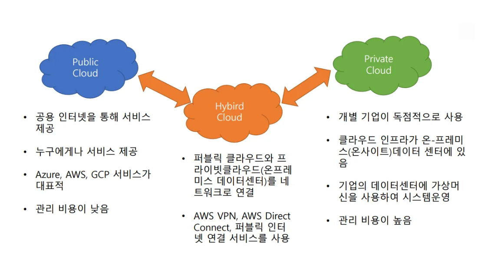
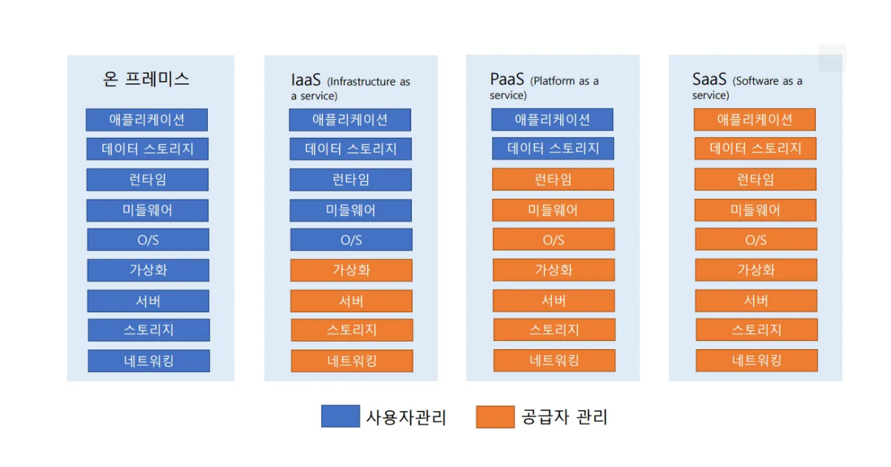

# 클라우드 컴퓨팅(Cloud Computing)

## 정의
- **클라우드 컴퓨팅**은 인터넷을 통해 서버, 스토리지, 소프트웨어 등 IT 자원을 빌려 쓰고, 사용한 만큼만 비용을 지불하는 서비스다.
- 이는 자체적인 IT 인프라를 구축하는 대신, 외부의 거대한 데이터 센터 자원을 활용하는 방식이다.
- 비유: 가정에서 발전소를 짓지 않고 한국전력에서 전기를 공급받는 것과 유사하다.

---

## 핵심 장점
- **비용 효율성**: 초기 투자 비용 없이 사용량 기반으로 비용을 지불한다.
- **유연한 확장성(Scalability)**: 필요에 따라 서버 용량을 손쉽게 늘리거나 줄일 수 있다.
- **민첩성**: 몇 분 내에 필요한 개발 환경을 구축하여 신속하게 서비스를 시작할 수 있다.
- **강력한 보안 및 안정성**: 전문 클라우드 기업(AWS, GCP, Azure)이 보안과 장애 관리를 책임진다.
- **글로벌 서비스**: 전 세계 데이터 센터를 활용하여 안정적인 글로벌 서비스를 제공한다.

---

## 서비스 종류 (서비스 모델)
빌려 쓰는 자원의 범위에 따라 다음과 같이 분류한다.
- **IaaS (Infrastructure as a Service)**: 서버, 스토리지, 네트워크 등 기본적인 인프라를 빌려 쓰는 방식이다. 사용자가 OS부터 모든 것을 직접 구성한다.
- **PaaS (Platform as a Service)**: 소프트웨어 개발에 필요한 환경(플랫폼)을 빌려 쓰는 방식이다. 개발자는 인프라 관리 없이 서비스 개발에만 집중할 수 있다.
- **SaaS (Software as a Service)**: 완성된 소프트웨어를 인터넷을 통해 바로 빌려 쓰는 방식이다. (예: 구글 드라이브, 넷플릭스)

---

## 운영 방식
사용 주체와 방식에 따라 다음과 같이 분류한다.
- **퍼블릭 클라우드 (Public Cloud)**: 여러 사용자가 함께 공유하는 공용 클라우드다. AWS, GCP, Azure가 대표적이다.
- **프라이빗 클라우드 (Private Cloud)**: 특정 기업만 단독으로 사용하는 전용 클라우드다. 높은 보안이 요구되는 경우에 사용된다.
- **하이브리드 클라우드 (Hybrid Cloud)**: 퍼블릭과 프라이빗 클라우드를 결합하여 사용하는 방식이다. 두 방식의 장점을 모두 활용할 수 있다.

AWS는 전 세계에 분산된 거대한 클라우드 서비스로, 그 인프라는 **리전(Region)**, **가용 영역(Availability Zone)**, **엣지 로케이션(Edge Location)**으로 구성된다.

---
### **AWS 글로벌 서비스**

---

AWS는 전 세계에 분산된 거대한 클라우드 서비스로, 그 인프라는 **리전(Region)**, **가용 영역(Availability Zone)**, **엣지 로케이션(Edge Location)**으로 구성된다.

### **AWS 글로벌 서비스 구성 요소**

#### **리전 (Region)**
- **정의**: AWS 데이터 센터가 모여 있는 물리적으로 떨어진 큰 지역이다. 예시: 서울, 도쿄, 뉴욕.
- **특징**:
  - 사용자와 가까운 리전을 이용해 서비스 지연 시간을 줄일 수 있다.
  - 한 리전에 문제가 발생해도 다른 리전은 영향을 받지 않아 안정성을 높인다.

#### **가용 영역 (Availability Zone)**
- **정의**: 한 리전 내에 위치한 독립적인 데이터 센터 그룹이다.
- **특징**:
  - 각 가용 영역은 물리적으로 격리되어 있어, 한 가용 영역에 장애가 발생해도 다른 가용 영역의 서비스는 계속된다.
  - 리전 내에 보통 2개 이상의 가용 영역이 존재하며, 이를 통해 서비스의 고가용성을 확보한다.

#### **엣지 로케이션 (Edge Location)**
- **정의**: AWS의 **CloudFront** 서비스가 사용자와 가까운 곳에서 데이터를 캐싱하여 콘텐츠 전송 속도를 높이는 작은 데이터 저장소다.
- **특징**:
  - 멀리 떨어진 리전까지 데이터를 요청할 필요 없이, 가장 가까운 엣지 로케이션에서 콘텐츠를 받아오므로 사용자에게 더 빠른 로딩 속도를 제공한다.
  - 이를 통해 동영상 스트리밍이나 웹페이지 로딩 속도가 개선된다.

  ### AWS 계정만들기

  https://antitifragile.notion.site/3-AWS-e5add09b5e1643569532e44f6bad6892

  ## AWS 보안과 운영 기초

  ### 클라우드 배포 모델

  

  ### 클라우드 컴퓨팅 모델 – 공급자와 사용자 관리

  

  #### IaaS – Infrastructure as a service
  - 물리적인 부분은 공급자가 관리
  - 사용자는 운영체제, 데이터 스토리지, 애플리케이션 관리
  - Amazon EC2 가 대표적인 서비스

  #### PaaS – Platform as a service
  - 물리적인 부분, OS 등 공급자가 모든 플랫폼 관리
  - 사용자는 데이터와 애플리케이션만 관리
  - 사용자는 애플리케이션 개발에만 집중 가능
  - AWS Elastic Beanstalk 이 대표적인 서비스

  #### SaaS – Software as a service
  - 모든 부분을 공급자가 관리
  - 사용자는 서비스를 사용만 하면 됨
  - Google Gmail 등이 대표적인 서비스

