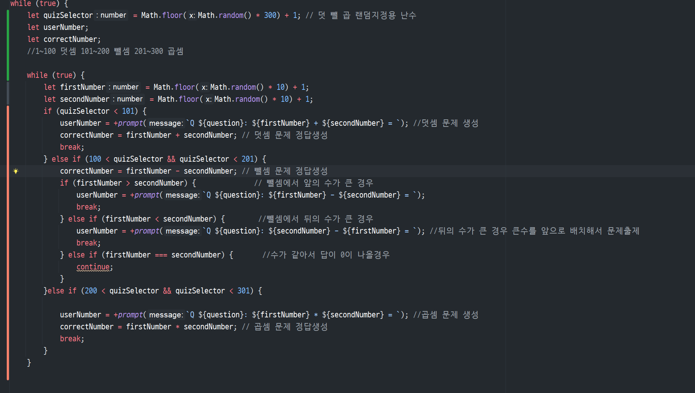

# 사칙연산 문제 출제 프로그램


## 요구사항
```
    # v 1.0
    시스템은 1~10사이의 무작위의 정수 2개를 생성하여
    덧셈 문제를 출제해야 한다.

    사용자는 출제된 문제의 정답을 입력할 수 있어야 한다.

    시스템은 사용자의 입력값을 확인해서 정답인지 오답인지를
    알려줘야 한다.

    시스템은 지속적으로 다른 문제를 출제하여 사용자가 0을 입력할 때까지
    답을 계속 입력받고 검증해줘야 한다.

    # v1.1 요구사항

    종료시점에 시스템은 정답횟수와 오답횟수를 출력한다.

    # v1.2 요구사항

    덧셈이외에 뺄셈, 곱셈을 랜덤으로 추가 출제한다.

    # v1.3 요구사항

    난이도를 3가지 (상중하)로 설정하여
    상 난이도에서는 세자리수 사칙연산문제를 출제
    중 난이도는 두자리수
    하 난이도는 한자리수
```


# 소스코드

```js
// 유저에게 레벨선택 입력받기


let levelSelector; // 난이도 설정용 변수 선언
while (true) {
    levelSelector = prompt(`난이도를 선택해주세요.\n\n 상 : 세자리수 사칙연산문제\n 중 : 두자리수 사칙연산문제\n 하 : 한자리수 사칙연산문제 `);
    if (levelSelector === '상') {
        alert(`'상' 난이도 학습을 시작합니다.\n 학습 종료를 원하시면 0을 입력해주세요`);
        break;
    } else if (levelSelector === '중') {
        alert(`'중' 난이도 학습을 시작합니다.\n 학습 종료를 원하시면 0을 입력해주세요`);
        break;
    } else if (levelSelector === '하') {
        alert(`'하' 난이도 학습을 시작합니다.\n 학습 종료를 원하시면 0을 입력해주세요`);
        break;
    } else if (isNaN(levelSelector) || levelSelector !== '') {
        alert(`상 중 하 만 입력가능합니다!`);
        continue;
    }
}


let question = 1; //문제 번호
let correct = 0; //정답갯수 카운트
let wrong = 0; //오답갯수 카운트


while (true) {
    let quizSelector = Math.floor(Math.random() * 300) + 1; // 덧 뺄 곱 랜덤지정용 난수
    let userNumber;
    let correctNumber;
    //1~100 덧셈 101~200 뺄셈 201~300 곱셈
    let firstNumber;
    let secondNumber;

    while (true) {
        //난이도에 따른 난수 범위설정
        if (levelSelector === `상`) {//세자릿수
            firstNumber = Math.floor(Math.random() * (999 - 100 + 1)) + 1;
            secondNumber = Math.floor(Math.random() * (999 - 100 + 1)) + 1;
        } else if (levelSelector === `중`) {//두자릿수
            firstNumber = Math.floor(Math.random() * (99 - 10 + 1)) + 1;
            secondNumber = Math.floor(Math.random() * (99 - 10 + 1)) + 1;
        } else if (levelSelector === `하`) {//한자릿수
            firstNumber = Math.floor(Math.random() * 9) + 1;
            secondNumber = Math.floor(Math.random() * 9) + 1;
        }

        // 사칙연산 랜덤설정
        if (quizSelector < 101) {
            userNumber = +prompt(`Q ${question}: ${firstNumber} + ${secondNumber} = `); //덧셈 문제 생성
            correctNumber = firstNumber + secondNumber; // 덧셈 문제 정답생성
            break;
        } else if (100 < quizSelector && quizSelector < 201) {

            if (firstNumber > secondNumber) {              // 뺄셈에서 앞의 수가 큰 경우
                userNumber = +prompt(`Q ${question}: ${firstNumber} - ${secondNumber} = `);
                correctNumber = firstNumber - secondNumber; // 뺄셈 문제 정답생성
                break;
            } else if (firstNumber < secondNumber) {        //뺄셈에서 뒤의 수가 큰 경우
                userNumber = +prompt(`Q ${question}: ${secondNumber} - ${firstNumber} = `); //뒤의 수가 큰 경우 큰수를 앞으로 배치해서 문제출제
                correctNumber = secondNumber - firstNumber; // 뺄셈 문제 정답생성
                break;
            } else if (firstNumber === secondNumber) {
                continue;//수가 같아서 답이 0이 나올경우 반복문 다시시작
            }
        } else if (200 < quizSelector && quizSelector < 301) {

            userNumber = +prompt(`Q ${question}: ${firstNumber} X ${secondNumber} = `); //곱셈 문제 생성
            correctNumber = firstNumber * secondNumber; // 곱셈 문제 정답생성
            break;
        }
    }


    if (userNumber === correctNumber) {
        alert(`정답입니다! 다음 문제로 넘어갈게요.`);
        correct++;
    } else if (userNumber === 0) {
        break;
    } else {
        alert(`오답입니다.. 다음 문제는 잘 맞춰봐요`);
        wrong++;
    }
    question++;
}
alert(`학습을 종료합니다. 다음에 만나요 !\n 맞춘 문제: ${correct} 개\n 틀린 문제: ${wrong} 개`);
```


# 코드작성 과정 및 오류해결.


## 1. `Math.floor(Math.random() * (x - y + 1)) + 1;` x이상 y이하의 난수생성

`Math.floor()` 는 소수점을 끊고 정수로 표현해주는 함수

이것을 이용하여 랜덤한 수로 사칙연산 문제를 출제한다. v 1.0에서는 덧셈문제만 출제하기 때문에 고려할 사항이 많지가 않았다.

## 2. 뺄셈 곱셈 연산 추가

### 2-1. 어떻게 랜덤으로 출제 할 것인가?

정확히 같은 확률로 곱셈 뺄셈 덧셈문제가 랜덤으로 출제되길 원했다.

* 우선 단순하게 3분의 1을 할 수 있는 범위를 설정해놓고 그 범위에서 랜덤으로 수를 뽑아 그 수에 해당하는 사칙연산을 출제한다.

### 이렇게 문제 출제 반복문의 최상단에 범위설정 변수를 선언하여 매 문제마다 랜덤뽑기를 진행시켰다.
```js
while (true) {
    let quizSelector = Math.floor(Math.random() * 300) + 1; // 덧 뺄 곱 랜덤지정용 난수
    let userNumber;
    let correctNumber;
    //1~100 덧셈 101~200 뺄셈 201~300 곱셈
    let firstNumber;
    let secondNumber;
```


### 그렇게 뽑힌 숫자에 따라 문제를 출제.

* 1~100 수가 나오면 덧셈문제 출제
* 101~200 이 나오면 뺄셈
* 201~300 이 나오면 곱셈


```js
// 사칙연산 랜덤설정
        if (quizSelector < 101) {
            userNumber = +prompt(`Q ${question}: ${firstNumber} + ${secondNumber} = `); //덧셈 문제 생성
            correctNumber = firstNumber + secondNumber; // 덧셈 문제 정답생성
            break;
        } else if (100 < quizSelector && quizSelector < 201) {

            if (firstNumber > secondNumber) {              // 뺄셈에서 앞의 수가 큰 경우
                userNumber = +prompt(`Q ${question}: ${firstNumber} - ${secondNumber} = `);
                correctNumber = firstNumber - secondNumber; // 뺄셈 문제 정답생성
                break;
            } else if (firstNumber < secondNumber) {        //뺄셈에서 뒤의 수가 큰 경우
                userNumber = +prompt(`Q ${question}: ${secondNumber} - ${firstNumber} = `); //뒤의 수가 큰 경우 큰수를 앞으로 배치해서 문제출제
                correctNumber = secondNumber - firstNumber; // 뺄셈 문제 정답생성
                break;
            } else if (firstNumber === secondNumber) {
                continue;//수가 같아서 답이 0이 나올경우 반복문 다시시작
            }
        } else if (200 < quizSelector && quizSelector < 301) {

            userNumber = +prompt(`Q ${question}: ${firstNumber} X ${secondNumber} = `); //곱셈 문제 생성
            correctNumber = firstNumber * secondNumber; // 곱셈 문제 정답생성
            break;
        }
    }
```

### 2-2 뺄셈의 해가 0이 나온다면?

낮은 확률로 두 항의 랜덤수가 동일해서 답이 0인 경우라면?
사용자는 0을 입력해야 해서 프로그램이 종료되게 된다.
어떻게 해결해야 할까?

* 방법 1: 종료문구를 다른것으로 바꾼다 '그만할래' 같은..
* 방법 2: 뺄셈을 해야하는 두 수를 다시 뽑아 출제한다. 해가 0이 아닐때까지


### 방법 1은 너무 쉽게 가는 기분이 들어서 반복문 연습 취지에 맞게 방법 2 를 선택하였다.




### 사칙연산 문제 생성 시, 뺄셈 결과가 0이 되지 않도록 두 항과 문제 변수를 while문으로 감싸 1/3 확률이 유지되게 재생성했다.
<br>


### 2-3 뺄셈의 앞의 항이 뒤의 항보다 수가 작다면?

### 멍청한 문제 발생

* 이건 단순하게 앞 뒤 순서만 바꿔서 출제하면 될 줄 알았다.

* if문 밖에서 `correctNumber` 변수를 `firstNumber - secondNumber` 로 지정해놓고 출력되는 문제에서의 순서만 바꿔놓으니
정답을 쳐도 오답이 나왔다.. ㅠㅠ 자괴감이 몰려온다.

```js
else if (100 < quizSelector && quizSelector < 201) {

            if (firstNumber > secondNumber) {              // 뺄셈에서 앞의 수가 큰 경우
                userNumber = +prompt(`Q ${question}: ${firstNumber} - ${secondNumber} = `);
                correctNumber = firstNumber - secondNumber; // 뺄셈 문제 정답생성
                break;
            } else if (firstNumber < secondNumber) {        //뺄셈에서 뒤의 수가 큰 경우
                userNumber = +prompt(`Q ${question}: ${secondNumber} - ${firstNumber} = `); //뒤의 수가 큰 경우 큰수를 앞으로 배치해서 문제출제
                correctNumber = secondNumber - firstNumber; // 뺄셈 문제 정답생성
                break;
            } else if (firstNumber === secondNumber) {
                continue;//수가 같아서 답이 0이 나올경우 반복문 다시시작
            }
```

그래서 이렇게  `correctNumber` 변수를 각 경우에 맞게 값이 들어가도록 if문 안으로 넣었다.


## 3. 난이도 설정 추가

### 이건 크게 어렵지가 않았다.

* 1. 유저에게 상 중 하 셋중 하나의 텍스트를 입력받는다.
* 2. 그 세가지의 값에 따라 계산에 쓰일 항의 범위가 설정되게 만든다.


### 사용자에게 난이도 입력받기
```js
let levelSelector; // 난이도 설정용 변수 선언
while (true) {
    levelSelector = prompt(`난이도를 선택해주세요.\n\n 상 : 세자리수 사칙연산문제\n 중 : 두자리수 사칙연산문제\n 하 : 한자리수 사칙연산문제 `);
    if (levelSelector === '상') {
        alert(`'상' 난이도 학습을 시작합니다.\n 학습 종료를 원하시면 0을 입력해주세요`);
        break;
    } else if (levelSelector === '중') {
        alert(`'중' 난이도 학습을 시작합니다.\n 학습 종료를 원하시면 0을 입력해주세요`);
        break;
    } else if (levelSelector === '하') {
        alert(`'하' 난이도 학습을 시작합니다.\n 학습 종료를 원하시면 0을 입력해주세요`);
        break;
    } else if (isNaN(levelSelector) || levelSelector !== '') {
        alert(`상 중 하 만 입력가능합니다!`);
        continue;
    }
}
```

### 입력받은대로 범위설정

```js
while (true) {
        //난이도에 따른 난수 범위설정
        if (levelSelector === `상`) {//세자릿수
            firstNumber = Math.floor(Math.random() * (999 - 100 + 1)) + 1;
            secondNumber = Math.floor(Math.random() * (999 - 100 + 1)) + 1;
        } else if (levelSelector === `중`) {//두자릿수
            firstNumber = Math.floor(Math.random() * (99 - 10 + 1)) + 1;
            secondNumber = Math.floor(Math.random() * (99 - 10 + 1)) + 1;
        } else if (levelSelector === `하`) {//한자릿수
            firstNumber = Math.floor(Math.random() * 9) + 1;
            secondNumber = Math.floor(Math.random() * 9) + 1;
        }
```


## 역시나 이 과정에서 멍청한 실수발생


```js
while (true) {
    let levelSelector; // 난이도 설정용 변수 선언
    levelSelector = prompt(`난이도를 선택해주세요.\n\n 상 : 세자리수 사칙연산문제\n 중 : 두자리수 사칙연산문제\n 하 : 한자리수 사칙연산문제 `);
 .
 .
 .
```
### 의식의 흐름대로 하다보니 `levelSelector` 변수를 while문 안에서 선언을 해버린 것.

저 변수는 밑에 있는 난이도에 따른 난수 범위설정 반복문에서 사용되어야 하는 중요한 변수이다.<br>
`let` 과 `const` 같은 변수는 블록 스코프 변수라고 해서 조건문이나 반복문 내에서 선언이 되면 해당 블록 `{}` 을 벗어나면 입력받은 값을 가져와서 사용하지 못한다. <br>한순간도 실수없이 스무스하게 넘어가는 일이 없다.. 아무튼 잘 기억해두어야겠다.

다시 밖으로 옮겨주니 해결 완료


# 그 외의 궁금증


```js
while(true){
    .
    .
    .
if (quizSelector < 101) {
            .
            .
            break;
        } else if (100 < quizSelector && quizSelector < 201) {

            if (firstNumber > secondNumber) {              // 뺄셈에서 앞의 수가 큰 경우
                .
                .
            } else if (firstNumber < secondNumber) {        //뺄셈에서 뒤의 수가 큰 경우
                .
                .
                break;
            } else if (firstNumber === secondNumber) {
                continue;//수가 같아서 답이 0이 나올경우 반복문 다시시작
            }
        } else if (200 < quizSelector && quizSelector < 301) {
            .
            .
            
        }
    }
```

### 세번째 else if 의 continue는 사실 없어도 다른 조건문들에 해당하는 조건이 없으면 while문은 다시 반복한다.

* 적지 않아도 다시 반복되는걸 뒤늦게 알았지만, 내 생각에는 그럼에도 명시적으로 적어두는게 가독성에 좋은 부분이지 않은가? 하는 생각이 든다.


# TIL 


### 1. 여러군데에서 사용할 블록스코프 변수 선언은 블록 밖에서 하자

### 2. continue 를 적지 않아도 반복문이 반복되는 상황이 있다. 인지하고 상황에 따라 잘 이용하자


***난수 생성하는것을 알게되면 야구게임을 만들어보고 싶었는데. 다음엔 그걸 만들어야겠다.***