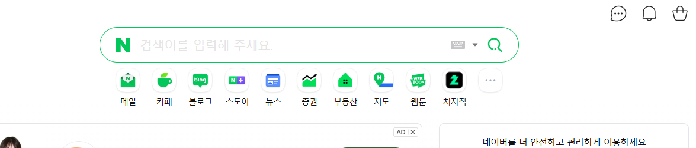
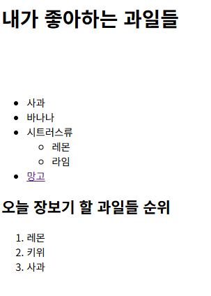
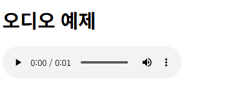
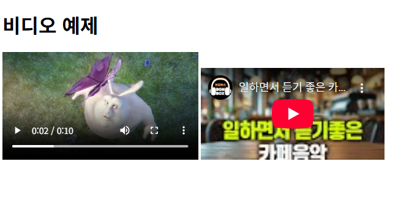
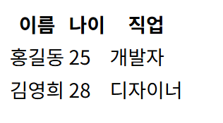
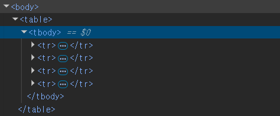
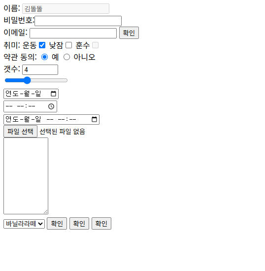

<div style="margin-top:30px;"> </div>

# HTML은 웹페이지의 구조를 만드는것

<div style="margin-top:70px;"> </div>

 ### HTML작업을 할 때에는 구조에 집중해야 한다. 이것이 가장 중요한 포인트임


<div style="margin-top:100px;"> </div>

# 제목 태그 (h1~h6)

### HTML에서 제목 태그는 `<h1>`, `<h2>`, `<h3>`, `<h4>`, `<h5>`, `<h6>` 의 6가지가 있다.<br><br> 숫자가 작을수록 더 중요하고 큰 제목을 나타냅니다.

### 제목태그는 번호를 건너뛰면 안된다. *ex) h2 없이 h3를 넣거나 하면 큰일남*

<div style="margin-top:100px;"> </div>


 ##  `h${안녕하세요$}*6` 하면


``` html
<h1>안녕하세요1</h1>
<h2>안녕하세요2</h2>
<h3>안녕하세요3</h3><h4>안녕하세요4</h4><h5>안녕하세요5</h5><h6>안녕하세요6</h6>
```
### 이렇게 작성이 된다.
<div style="margin-top:100px;"> </div>

# 순서없는 목록 ul li

<div style="margin-top:100px;"> </div>




## 위 사진에 있는 저 목록들이 ul li로 만들어진것.

<br>

### ul의 하위태그는 반드시 li 여야한다.

<br>

ul li 명령어 사용 예시 <br>

``` html
<body>

  <h1>내가 좋아하는 과일들</h1>

  <ul>
    <li>사과</li>
    <li>바나나</li>
    <li>시트러스류
      <ul>
        <li>레몬</li>
        <li>라임</li>

      </ul>
```
<br>




### 이런식으로 목록이 생성되었다. 
### Ul li 명령어는 순서가 상관없는 목록을 만들때 쓰인다.<br> 네이버처럼 배치하고 하는것은 css의 영역.<br>html에서는 저 목록이 존재하도록 구조를 만들어버리는 것이다. <br>위 사진의 "시트러스류" 목록처럼 중첩목록도 만들어진다.
<div style="margin-top:100px;"> </div>

# 순서 있는 목록 ol li 

<div style="margin-top:100px;"> </div>

### ol 태그의 가장 큰 특징은 자동으로 항목에 번호를 매겨준다는 점이다. <br> li 항목을 추가하거나 삭제하면 브라우저가 자동으로 번호를 다시 매겨준다.
### `<ol reversed>` 를 사용하여 번호를 역순으로 매길 수도 있다.


``` html
<h2>오늘 장보기 할 과일들 순위</h2>
    <ol>
      <li>레몬</li>
      <li>키위</li>
      <li>사과</li>
    </ol>
```
<br>


### 위 사진의 밑부분에에 생성된 레몬 키위 사과 목록이 Ol li 명령어로 만들어진 것.

### ol li도 마찬가지로 ol 의 하위태그는 반드시 li가 있어야한다.

<div style="margin-top:100px;"> </div>

# 하이퍼링크
<div style="margin-top:100px;"> </div>

## URL로 링크걸기

``` html
<a href="https://google.com">구글로 이동하기</a>
<a href="https://daum.net" target="_blank">다음으로 이동하기</a>    
```
### `<a href="목적지 URL">링크 텍스트</a>` 식으로 작성한다.


### 이렇게 생성이 된다.
<br>

### 이 외에도 다양하게 연결이 가능한데
``` html
<a href="about.html">회사 소개</a>

<h2 id="section2">두 번째 섹션</h2>
<a href="#section2">두 번째 섹션으로 이동</a>

<a href="mailto:example@gmail.com">이메일 보내기</a>
<a href="tel:010-1234-5678">전화 걸기</a>

<a href="https://www.google.com" target="_blank">새 탭에서 구글 열기</a>

<a href="document.pdf" download>PDF 다운로드</a>

```

### 등이 있다.


<div style="margin-top:100px;"> </div>


## 이미지 삽입하기

```html

```

<br>

### 이미지 경로를 URL로 지정할수도 있지만, 로컬파일의 이미지를 삽입할때에는 경로입력에 신경을 써야한다.

### HTML에서는 상대경로기준으로 판단함 현재 위치한 파일의 위치를 기준으로 링크경로를 설정해야한다.

<br>

``` html

<body>

    <div>
    
    </div>

</body>

```

### tip) 이미지는 div로 감싸서 넣는것이 좋다 이유는 나중에 배운다. 액자를 만들어준다고 생각하자


<div style="margin-top:50px;"> </div>

이미지 사이즈 조절을 할때에는 한쪽만
<br>ex) width , height
<br>해주면 원본 비율에 맞게 사이즈가 조절된다

tip) 이미지는 div로 감싸서 넣는것이 좋다 이유는 나중에 배움 액자를 만들어준다고 생각하자


<div style="margin-top:100px;"> </div>

# 오디오와 비디오

<div style="margin-top:100px;"> </div>

## Audio

### `<audio src="music.mp3" controls></audio>` 로 웹페이지에 재생 컨트로로가 함꼐 오디오 플레이어가 추가된다.



### 이런식으로 생성이 된다.


<br>

## Audio 태그의 속성

| 속성       | 설명                                                                 |
|------------|----------------------------------------------------------------------|
| `controls` | 재생, 일시정지, 볼륨 조절 등 사용자 컨트롤 UI 표시                   |
| `autoplay` | 페이지 로드 시 자동 재생 (브라우저 정책에 따라 제한될 수 있음)       |
| `loop`     | 오디오 재생 완료 후 자동 반복                                        |
| `muted`    | 음소거 상태로 시작                                                   |
| `preload`  | 오디오 파일을 어떻게 미리 로드할지 설정                              |
| └ `auto`       | 전체 파일 미리 로드 (기본값)                                  |
| └ `metadata`   | 메타데이터만 미리 로드                                        |
| └ `none`       | 미리 로드하지 않음                                            |


<div style="margin-top:100px;"> </div>

## Video

<br>

### `<video src="movie.mp4" controls width="640" height="360"></video>` 
### 이렇게 사용한다.




<br>

### 왼쪽 토끼영상이 저 부분이다.


<div style="margin-top:100px;"> </div>

## iframe

### `<iframe src="페이지URL" width="너비" height="높이"></iframe>`

### 웹페이지 안에 또 다른 웹페이지를 넣을 수 있는 창문과 같은 역할을 한다.

<div style="margin-top:50px;"> </div>

### iframe은 다음과 같은 상황에서 특히 유용하다.

- 유튜브, 비메오 같은 동영상 삽입
- 구글 맵스 지도 삽입
- 소셜 미디어 피드나 버튼 통합
- 외부 도구(결제 시스템, 폼 등) 임베딩
- 다른 도메인의 콘텐츠를 현재 페이지에 표시

<div style="margin-top:100px;"> </div>


<br>

### 오른쪽 유튜브 페이지가 iframe으로 넣은 부분이다.


<div style="margin-top:200px;"> </div>


# Table
### 표를 만드는 태그이다. <br><br> 요즘 웹 사이트에 표 얼마나 필요할까 싶지만 게시판을 만들때도 쓰이는 중요한 기능이다.

<br>

### 표의 구조와 기본태그

- `<table>`: 표 전체를 감싸는 컨테이너
- `<tr>`: 표의 행(Table Row)
- `<td>`: 행 안의 데이터 셀(Table Data)
- `<th>`: 헤더 셀(Table Header)

<br>

``` html
 <table>
        <tr>
            <th>이름</th>
            <th>나이</th>
            <th>직업</th>
        </tr>
        <tr>
            <td>홍길동</td>
            <td>25</td>
            <td>개발자</td>
        </tr>
        <tr>
            <td>김영희</td>
            <td>28</td>
            <td>디자이너</td>
        </tr>
    </table>
```

### 이런식으로 코드를 작성하면




### 이렇게 표가 작성이 된다.


<div style="margin-top:100px;"> </div>


### `table>tr*3>td*2` 이런식으로 한번에 만들수도 있다.

 ``` html
  <table>
            <tr>
                <td></td>
                <td></td>
            </tr>
            <tr>
                <td></td>
                <td></td>
            </tr>
            <tr>
                <td></td>
                <td></td>
            </tr>
        </table>
 ```

<div style="margin-top:100px;"> </div>

## 꼭 알고 넘어가야 할 부분
<div style="margin-top:50px;"> </div>

 ### 위 방법들처럼 코드를 작성했을때 문제없이 테이블이 만들어 지지만 <br><br>html 검사를 해보면 
 




 <div style="margin-top:50px;"> </div>

 ### 이렇게 `<tr>`과 `<table>` 사이에는 `<tbody>`라는 태그가 자동으로 들어감을 인지하고 있어야한다.<br>
 ### 그러니까 `<tr>` 의 상위 태그는 `<tbody>` 가 되는 것이다. 절대 잊지말자


<div style="margin-top:100px;"> </div>

# Form

<div style="margin-top:50px;"> </div>

## form은 웹사이트에서 사용자와 정보를 소통하는 역할.




### 이렇게 정보를 입력받아 상호작용 할 수 있는 여러 기능들을 만들수있게 하는 것이다.
### 데이터를 어떻게 받아서 어디로 보내고 어떻게 응답해줄지 만드는 것.
### 딱 봐도 굉장히 중요해 보인다. 그래서 데이터를 입력받는 방식도 엄청나게 많다.
### CSS를 배울때 제대로 써보면서 다시 정리해두는 것이 좋을것같아서 일단 넘어가야겠다.


<div style="margin-top:100px;"> </div>


 # 기타 단축키들 정리

| 단축키 | 기능 설명 |
|--------|-----------|
| `Ctrl + Alt + L` | **코드 서식 정리** (자동 정렬, 들여쓰기 등) |
| `Ctrl + /` | **한 줄 주석 생성/제거** |
| `Alt + 1` | **사이드바(Project 창) 열기/닫기** |
| `Alt + Shift + ↑ / ↓` | **현재 줄 이동** (줄을 위/아래로 끌어올림) |
| `Ctrl + E` | **최근 열었던 파일 목록 보기** |
| `Alt + Insert` | **새 파일 또는 코드 템플릿 생성 (예: 클래스, 인터페이스 등)** |
| `Ctrl + Alt + T` | **코드를 감싸기 (if, try-catch, for 등으로 감쌈)** |

<div style="margin-top:100px;"> </div>

# 깨알팁들

1. 툴을 사용할 때 윈도우 사용자 이름은 영어로 해야 충돌이 없다 중간경로에 한글이 있으면 문제가 생길 수 있음


2. HTML의 태그를 정확히 쓰지 않으면
시청각 장애인들의 스크린 리더기에서는 구분을 할 수가 없다.


<div style="margin-top:100px;"> </div>


# 한줄 TIL

<div style="margin-top:100px;"> </div>

### HTML은 구조를 만드는것이다.
### 그냥 이 문장에 꽂힌 것 같다.


